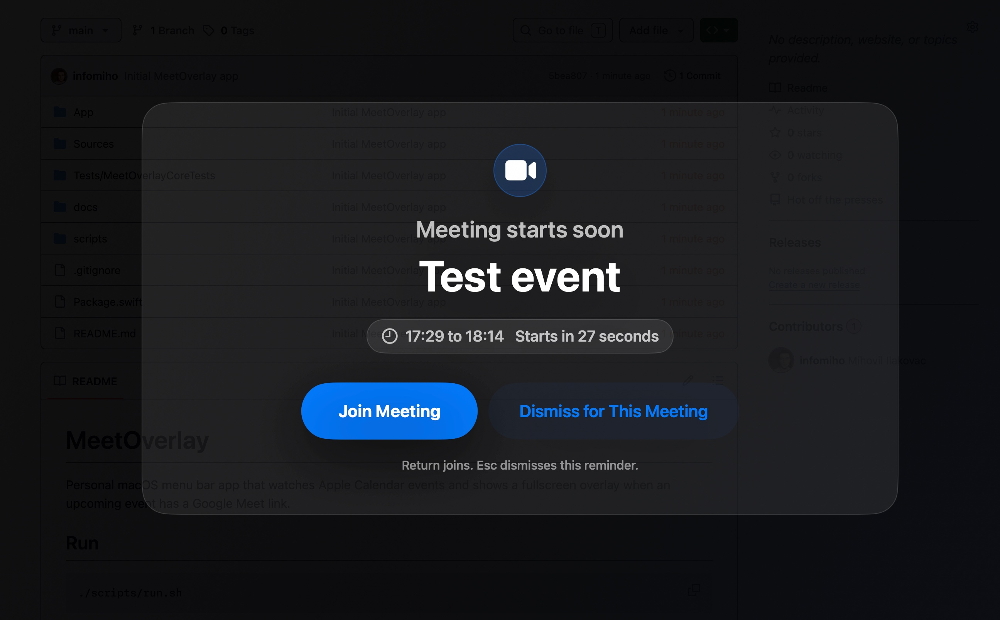

# MeetOverlay

Native macOS menu bar app that watches Calendar for meetings with video call links and reminds you before they start — with a fullscreen overlay, a system notification, or both — so you never miss the next call.



## Features

- Detects Google Meet, Zoom, Microsoft Teams, and Webex links in your calendar events
- Fullscreen overlay reminder with the meeting's title, time, duration, attendees, and a one-click join button
- Native macOS notifications as an alternative or complement, with Join Meeting and snooze action buttons
- Configurable alert lead time (default 15 minutes before the meeting, in minutes or seconds)
- Snooze with configurable durations — from the overlay, from the notification, or with the `S` key
- Optional meeting room callout: match a room that books itself as an attendee (wildcard pattern, e.g. `MTL-*`) or fall back to the event's location
- Menu bar list of today's and tomorrow's events with start time and length; hover an event for attendees, the room, and a join shortcut

## Run

```sh
./scripts/run.sh
```

## Install

```sh
./scripts/install.sh
```

This builds, signs, copies, and opens `~/Applications/MeetOverlay.app`. To install into the system Applications folder instead, run:

```sh
INSTALL_DIR=/Applications ./scripts/install.sh
```

After installing, enable `Open at Login` in `Settings...` if you want the app to start automatically.

## Using the app

The app appears in the menu bar. It lists today's and tomorrow's events with their start time and length, marks events that have a video call link, and shows today's next event as the menu bar title. Hovering an event that has attendees opens a submenu with a join item, the meeting room, and the attendee list.

Use `Settings...` from the menu bar dropdown to choose visible calendars, pick reminder styles (fullscreen overlay and/or system notifications), set how long before a meeting the alert fires, configure snooze options, set up the meeting room callout, and enable startup at login.

On the fullscreen overlay, `Return` joins, `Esc` dismisses, and `S` snoozes by the shortest configured option; the Snooze menu offers the full list. The overlay plays `App/Resources/notification.mp3` when it appears.

System notification permission is requested the first time you enable notifications in Settings. The banner's options carry Join Meeting and one snooze action per configured duration; snoozed reminders come back when the snooze expires.

Preferences are stored in macOS `UserDefaults`.

Calendar permission is tied to the app's bundle identifier, path, and code-signing identity. The build script uses an available `Apple Development` signing identity when possible. If it falls back to ad-hoc signing, macOS may ask for Calendar access again after rebuilds.

## Requirements

macOS 14 or newer and Xcode — the build runs the test suite, which needs the full Xcode toolchain rather than the command line tools alone. Google Calendar events must be synced into Apple Calendar.

No paid Apple Developer account is needed for local use.
